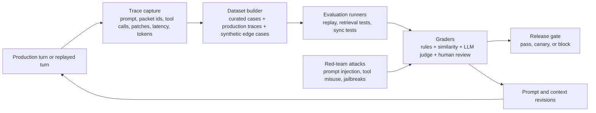
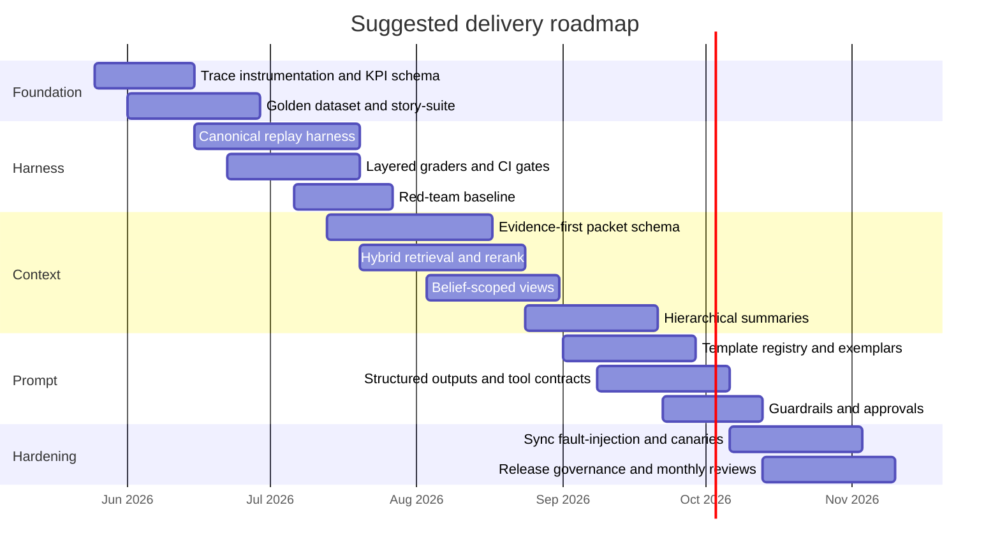

# Harness, Context, and Prompt Engineering for the Mtherios System

## Executive summary

The uploaded report describes a browser-first narrative system with Svelte and Dexie on the client, a Postgres-backed canon and memory layer on the backend, split turn ownership, hybrid local/server retrieval, source-linked memory nodes, retrieval packets, and offline sync. It also identifies the most important fault lines: browser-owned live narration, duplicated faction state, hybrid memory behavior, confusion between transcript evidence and canon, and the need for source-linked compression for long-running roleplay. In that setting, the highest-leverage improvement is **not** prompt tuning in isolation. The right sequence is **harness engineering first, context engineering second, and prompt engineering third**.

Harness engineering should come first because modern LLM systems are nondeterministic and cannot be safely improved with software-style “it seems better” testing. OpenAI’s evaluation guidance recommends an explicit loop of objective → dataset → metrics → comparison → continuous evaluation, with datasets built from production data, historical logs, curated expert cases, and adversarial cases. Anthropic likewise frames clearly defined success criteria and evaluations as the foundation of prompt engineering, not something added later. Trace-driven tooling is now mature enough to make this practical: OpenTelemetry defines GenAI events, metrics, model spans, and agent spans, and production tracing systems can capture retrieval, token use, tool calls, prompts, and latency end to end. citeturn27view2turn27view3turn15view16turn15view7turn18view5turn25view2

Context engineering is the second priority because the uploaded report explicitly says prompt reliability depends on the state snapshot and retrieval packet feeding the model. That is consistent with the literature. Retrieval-augmented generation improves factuality and provenance by combining parametric knowledge with explicit memory; Self-RAG shows gains from adaptive retrieval and critique instead of always stuffing a fixed number of passages into the prompt; Generative Agents shows that a memory stream works better when the model retrieves the most relevant items rather than trying to summarize everything into one blob; and *Lost in the Middle* shows that raw long-context stuffing is brittle when the key evidence sits in the middle of the input. Hierarchical summaries can help long-term memory, but they must remain source-linked and continuously refreshed, or they become another ungrounded canon layer. citeturn19view0turn19view1turn19view5turn20view0turn21view0turn19view6turn21view2

Prompt engineering still matters, but in this system it should be treated as a **controlled interface** around validated context and tools, not as the main source of correctness. Current provider guidance strongly supports structured developer prompts, examples, XML/Markdown boundaries, reusable prompt templates, structured outputs for schema-constrained results, and explicit tool guidance. At the same time, newer reasoning-model guidance says explicit “think step by step” prompting is often unnecessary; instead, use delimiters, task decomposition, and evaluation harnesses to verify outcomes. For this project, that means backend-owned prompt templates, versioned exemplars, structured-output patch proposals, targeted tool descriptions, moderation and prompt-injection guardrails, and approvals on high-risk world-state operations. citeturn24view0turn16view11turn23view5turn23view6turn23view7turn22view1turn29search6turn15view25turn15view26

The report does **not** appear to include numerical baselines for latency, retrieval quality, contradiction rate, sync conflict rate, grader agreement, or token cost. Because of that, the most defensible immediate plan is to build the measurement and replay harness first, then rework memory packets and prompt templates under controlled experiments. Without that order, the team will likely optimize the visible prompt while the hidden failure is actually in packet assembly, retrieval ranking, sync order, or unvalidated canon writes.

## Project baseline and missing measurements

From the uploaded report, the current system can be summarized in one sentence: **the browser still owns much of the live turn loop, while the backend already contains the cleaner ideas the project actually wants to trust**. Dexie carries recent transcript and dense local state; Postgres already has cleaner canon objects, event and patch ledgers, memory nodes, beliefs, and sync operations. The report also states that prompt quality depends on the snapshot and retrieved packet, and that long-roleplay recall should come from source-linked events and memory nodes rather than broad prose summaries.

That architecture makes three engineering consequences unavoidable. First, harnesses must test **both** online play and replayed historical turns, because split authority and offline sync create defects that only appear over time. Second, context engineering must explicitly separate **truth, belief, and evidence**, because the report already distinguishes transcript evidence from canonical state and warns about NPC omniscience. Third, prompt changes must be versioned and evaluated against the same story fixtures, because otherwise prompt edits simply mask context defects instead of fixing them.

The report also lacks several measurements that are standard for reliable LLM systems. Those should become first-class telemetry and dataset fields before major prompt or retrieval work begins. OpenAI recommends production-grounded datasets, context precision/recall targets for document-Q&A, and continuous evaluation on every change; Anthropic recommends measuring latency explicitly, including time to first token; and OpenTelemetry plus modern tracing platforms now support the events, spans, and metrics needed to capture these signals. citeturn27view2turn27view3turn22view7turn15view7turn25view2

| Missing measurement | Why it matters in this system | How to collect it |
|---|---|---|
| Time to first token and full-turn latency | Browser-owned streaming can hide backend cost until the system is centralized; TTFT is the most useful UX-facing latency metric for streamed narration. citeturn22view7 | Add start/end timestamps for input receipt, retrieval completion, model first token, model completion, patch validation, and sync publish |
| Input tokens, output tokens, and cached-token ratio | The project has large repeated prompt prefixes and dynamic packets; token spend will be dominated by context strategy, not just model choice. Prompt caching can materially reduce latency and cost when prefixes are stable. citeturn15view15turn17view0 | Emit token counts per span, identify stable prompt prefix hashes, and track cache hit eligibility |
| Context precision, context recall, and source coverage | The report’s biggest context risk is packet quality. OpenAI explicitly recommends context precision and recall for doc-Q&A style systems. citeturn27view2 | Build gold questions with expected source event IDs and evaluate retrieved packet membership |
| Unsupported-claim and canon-drift rate | The report distinguishes evidence from canon; this must be measured, not assumed | Automatic claim-to-source checks on sampled turns, plus periodic human audits |
| NPC omniscience leakage rate | The report explicitly wants belief-scoped views rather than omniscient truth | Controlled eval set with hidden facts and actor-specific visibility rules |
| Sync conflict and reconciliation failure rate | Offline queue + backend canon guarantees failure modes that prompt edits will never solve | Instrument sync retries, rejected operations, duplicate writes, manual repair events |
| Tool-call precision and argument-validity rate | The system appears to rely on world-update tools/classifiers; tool errors become canon errors | Trace every tool request/result and grade appropriateness plus schema validity |
| Grader agreement and human-vs-judge correlation | LLM judges are only useful when calibrated against humans and clear rubrics. citeturn22view4turn23view9 | Sample pass/fail disagreements for human review; track agreement per rubric and slice |

## Harness engineering

Harness engineering, in this project, means building the machinery that can **replay, grade, compare, observe, and block regressions** across the full turn pipeline: input, retrieval packet, prompt, model output, tool calls, patches, sync, and final rendered narration. OpenAI’s eval guidance is especially relevant here because it emphasizes that LLM evaluation should focus on classification, pairwise comparison, and scoring against specific criteria rather than vague open-ended judgment, and it recommends continuous evaluation on every change. LangSmith, Braintrust, Phoenix, and Promptfoo all reinforce the same pattern from different angles: datasets, evaluators, experiments, prompt comparisons, trace inspection, and red teaming belong in the same loop, not in separate tools that never meet. citeturn27view2turn23view9turn23view10turn25view0turn26view0

A practical harness stack for this system should look like the following.

| Technique | What it is and why it matters here | Concrete implementation steps | Measurable KPIs | Pros | Cons | Estimate |
|---|---|---|---|---|---|---|
| Canonical replay harness | Re-run a historical turn from frozen inputs, packet IDs, tool results, and canon state, then compare outputs and accepted patches. This is the only reliable way to catch regressions in a split-authority system. OpenAI recommends identifying where nondeterminism enters the system and evaluating those points continuously. citeturn27view2turn27view3 | Store immutable turn fixtures with user input, retrieved packet IDs, prompt version, model settings, tool IO, accepted patches, and resulting story entry. Add a replay runner that can operate in “compare text,” “compare tools,” and “compare accepted canon” modes. | Replay coverage; replay pass rate; patch agreement rate; contradiction rate vs baseline | High signal, reproducible, excellent for CI | Requires fixture storage discipline and backfills | Effort: medium. Cost: low–medium. Risk: low |
| Golden story-suite dataset | A curated set of representative scenarios covering faction diplomacy, secret knowledge, contradictory rumors, long-roleplay recall, player retries, offline reconnect, and sync conflicts. OpenAI and Anthropic both recommend success-criteria-driven datasets with production, historical, expert, and adversarial cases. citeturn27view2turn23view8turn23view9 | Create 100–300 hand-labeled story cases; mine additional examples from traces and logs; generate synthetic variants around edge cases; version the dataset and slice by failure mode | Coverage across target slices; human satisfaction on gold set; regression rate by slice | Makes quality visible to stakeholders | Needs curation and ongoing maintenance | Effort: medium. Cost: medium. Risk: low |
| Layered grading pipeline | Use deterministic graders where possible, then semantic similarity, then model-based judges, then human review for calibration. OpenAI’s graders support `string_check`, `text_similarity`, `score_model`, multi-graders, and Python graders; LangSmith supports human, code, LLM-as-judge, and pairwise evaluation. citeturn28view2turn28view3turn28view4turn28view1turn23view9 | For each rubric, define a pass/fail rule if possible, then add semantic or model-based scoring only where necessary. Use Python graders for business rules such as “no omniscient fact appears in actor view” or “patch does not alter unrelated faction fields.” Calibrate judges against human labels monthly. | Judge-human agreement; false-pass rate; false-fail rate; rubric coverage | Cost-efficient and scalable | Judge drift if not calibrated | Effort: medium. Cost: low–medium. Risk: medium |
| Retrieval and packet harness | Evaluate not just the final answer but the packet that fed it: were the right sources present, ranked well, scoped correctly, and cited? OpenAI’s Q&A-over-docs example recommends context recall and precision targets; retrieval pipelines improve when reranking is evaluated separately from generation. citeturn27view2turn15view12turn19view0 | Build “question → expected source IDs” datasets for lore, factions, threads, and NPC beliefs; score first-stage retrieval, reranked top-k, final packet inclusion, and answer grounding separately | Recall@k; precision@k; rerank lift; source coverage; unsupported-claim rate | Reveals where failures originate | Requires source labeling | Effort: medium. Cost: medium. Risk: low |
| Sync and fault-injection harness | Simulate out-of-order sync ops, offline edits, reconnect storms, duplicate world updates, and partial backend failures. This is uniquely important because the uploaded report already identifies offline sync and split turn ownership as fault lines. General eval guidance says to evaluate the place where nondeterminism enters the architecture; here that includes sync order and reconciliation. citeturn27view2 | Create property-based tests and scenario fuzzers for sync queues, retries, and merge order. Record whether canon or transcript diverges after reconciliation. Compare browser-authoritative vs backend-authoritative paths during migration. | Sync conflict rate; duplicate-op rate; reconciliation success; divergence after reconnect | Finds defects prompt tuning cannot fix | Harder to label than pure prompt failures | Effort: medium–high. Cost: medium. Risk: medium |
| Trace-first observability and release gates | Instrument the full turn path using GenAI spans/events and route results into dashboards and CI release checks. OpenTelemetry defines the GenAI telemetry shape; Agents SDK tracing and Phoenix both show how to capture prompts, tools, retrieval, tokens, and latency. Promptfoo adds adversarial testing and CI integration. citeturn15view7turn18view5turn25view2turn26view0turn16view15 | Emit spans for packet assembly, retrieval candidates, rerank, model call, tool call, patch validation, and sync publish. Block releases when key evals regress beyond tolerance. Add adversarial suites for prompt injection, jailbreaks, tool misuse, and data leakage. | Trace coverage; p95 latency; token cost per turn; release-block count; red-team pass rate | Turns quality into an operational system | More plumbing and data governance work | Effort: medium. Cost: low–medium. Risk: low |

For this project, the most important harness recommendation is to make **packet-level grading** and **sync fault injection** peers to ordinary prompt evaluation. If the system only grades the final prose, it will miss the exact two defects the report is most worried about: drift between canon and transcript, and bad context entering the prompt in the first place.

## Context engineering

Context engineering is the discipline of deciding **what information becomes prompt context, in what form, under what authority, ordered how, and with which freshness guarantees**. In the Mtherios system, this is the single highest-leverage technical layer after harnesses, because the uploaded report already says the prompt is only as reliable as the snapshot and packet feeding it.

The research base here is unusually clear. RAG improves factuality and provenance by grounding generations in non-parametric memory. Self-RAG shows that fixed, indiscriminate retrieval can hurt versatility and that adaptive retrieve/generate/critique loops improve factuality and citation accuracy. Generative Agents shows that full memory streams distract the model and that retrieval should surface a subset of memories using relevance, recency, and importance. Recursive long-term dialogue memory shows that continuously updated summaries can preserve long-horizon context. And *Lost in the Middle* shows that long context alone is not enough; relevant information hidden in the middle is systematically harder for models to use. citeturn19view0turn19view5turn20view0turn19view6turn21view0

One nuance matters for this system: **provider guidance on prompt ordering is not universal**. OpenAI’s general prompt guide suggests the developer message usually works well in the order identity → instructions → examples → context, with context commonly near the end of the developer prompt. Anthropic’s long-context guidance, by contrast, recommends placing long-form documents near the top and the query near the end for 20k+ token document tasks, and it reports quality gains in its own tests from that pattern. For Mtherios, prompt order should therefore be treated as an empirical variable in the harness, not a permanent doctrine. citeturn24view0turn30view0

| Technique | What it is and why it matters here | Concrete implementation steps | Measurable KPIs | Pros | Cons | Estimate |
|---|---|---|---|---|---|---|
| Evidence-first memory packets | Replace broad mixed memory blobs with compact packets composed of source-linked facts, recent events, validated patches, unresolved threads, belief deltas, and freshness metadata. RAG and Generative Agents both show that retrieved evidence beats monolithic summary stuffing for grounded behavior. citeturn19view0turn20view0 | Define a packet schema with `section_type`, `entity_id`, `belief_scope`, `source_ids`, `freshness_ts`, `confidence`, and `token_cost`. Build packets from backend canon first; use local fallback only when offline and mark it as fallback. | Citation/source coverage; packet size; unsupported-claim rate; packet build latency | Strong provenance; easier debugging | Requires schema work and packet builder discipline | Effort: medium. Cost: medium. Risk: low |
| Hierarchical summary pyramid | Use recent exact evidence, mid-range event summaries, and long-range chapter/arc summaries, all source-linked. Recursive summarization improves long-term dialog memory when continuously updated, but summaries should refresh from evidence instead of accumulating drift through summary-of-summary compression. citeturn19view6turn21view2 | Keep last 3–10 turns exact; summarize event clusters into chapter nodes; summarize chapters into arc nodes; store all parent-child source links. Rebuild long-range summaries periodically from event layers, not only from prior summaries. | Summary freshness; summary-source coverage; long-horizon recall score; contradiction rate across layers | Good balance of recall and token cost | Summaries can drift if refresh policy is weak | Effort: medium. Cost: medium. Risk: medium |
| Belief-scoped views | Build separate context views for narrator truth, actor beliefs, and public/shared world state. The report explicitly wants non-omniscient NPCs, and believable agent behavior improves when memory, reflection, and planning are conditioned on the right subset of knowledge. citeturn20view0turn19view8turn19view9 | For every packet item, assign one of three scopes: `narrator_truth`, `actor_belief`, or `public_world`. At generation time, populate only the scopes appropriate to the current narrator or NPC. Add grader rules that fail if actor output references hidden facts without a reveal source. | Omniscience leakage rate; belief-view precision; narrative consistency score | Directly addresses one of the report’s main goals | Requires explicit visibility metadata | Effort: medium. Cost: low–medium. Risk: medium |
| Hybrid retrieve-and-rerank | Use exact alias match + metadata filters + lexical retrieval + vectors in first stage, then a reranker in second stage. OpenAI’s File Search uses both vector and keyword retrieval; Elastic recommends hybrid search with reciprocal rank fusion; cross-encoder rerankers are a standard way to improve final relevance. Hosted rerankers from Cohere and Voyage are mature enough to be practical if the team does not want to train its own. citeturn14search2turn15view13turn15view14turn15view12turn15view20turn15view21 | Stage 1: alias, speaker, faction, location, thread, and time filters plus keyword and vector retrieval. Stage 2: rerank top 20–50 candidates. Stage 3: cap and compress to packet sections by type. Log candidate set and rerank scores for every turn. | Recall@20; precision@10; rerank lift; retrieval latency p95 | Higher relevance without forcing huge packets | Adds a second retrieval stage and latency | Effort: medium. Cost: medium. Risk: low |
| Token budgeting, ordering, and caching | Explicitly budget tokens by section and A/B test packet order per model family. *Lost in the Middle* warns against assuming long context is enough; OpenAI prompt caching rewards stable prefixes; Anthropic recommends careful long-context ordering and quoting relevant evidence first. citeturn21view0turn15view15turn17view0turn30view0 | Set hard token quotas for: system/developer instructions, scene state, actor belief packet, narrator truth packet, recent dialogue, and safety/tool metadata. Keep stable prefixes identical to maximize caching. Test at least two orderings per model family. Require the model to cite or quote the packet lines it relies on for long-context tasks. | TTFT; total input tokens; cached-token ratio; packet dropout rate; long-context error rate | Improves speed and cost while making trade-offs explicit | Order may be model-specific, not universal | Effort: low–medium. Cost: low. Risk: low |
| Offline freshness and fallback discipline | The report already recommends backend-built memory first and local fallback only when offline. Self-RAG further argues against indiscriminate retrieval. For this system, a local packet should never masquerade as fresh canon. citeturn19view5 | Add packet-level `freshness` and `authority` flags such as `canonical_fresh`, `canonical_stale`, `local_fallback`, and `draft_only`. Penalize or exclude stale local sections when the backend is reachable. Expose freshness to graders and telemetry. | Stale-packet usage rate; contradiction rate after reconnect; fallback frequency | Keeps offline mode honest | Slightly more UI and packet complexity | Effort: low–medium. Cost: low. Risk: low |

A concrete packet shape for this system should probably look like this in practice: a stable scene summary; actor-specific beliefs; narrator-only truth blocks; recent exact evidence; unresolved threads and agreements; faction deltas; and source references for every nontrivial claim. The key design principle is that **the packet should be an argument assembled from evidence, not a loose scrapbook of “maybe useful” text**.

## Prompt engineering

Prompt engineering is the narrowest of the three disciplines here, but it is still important because it controls how the model interprets the packet, uses tools, proposes structured outputs, and behaves under adversarial or ambiguous input. The highest-value prompt changes for this system are those that make the model **more bound to the packet and less free to invent canon**.

OpenAI’s prompt documentation is particularly relevant in two ways. First, it treats `developer` messages as higher priority than `user` messages and describes them as the system’s rules and business logic, with the user message acting more like arguments to that function. Second, it recommends explicit developer-message structure using identity, instructions, examples, and context, and supports reusable prompt templates that can be versioned and deployed without changing integration code. Anthropic’s guidance aligns on clarity, examples, XML structure, role prompting, and tool guidance. Together, these sources strongly support moving prompt assembly and versioning out of ad hoc browser strings and into a backend-owned prompt registry. citeturn24view0turn30view0

There is also an important nuance around chain-of-thought. Classic chain-of-thought prompting research showed large gains on complex reasoning when models were given intermediate reasoning exemplars. But current official guidance for reasoning models says explicit “think step by step” prompting is generally unnecessary; better results come from high-level guidance, delimiters, and clean problem structure. For Mtherios, the practical implication is not “never decompose tasks,” but rather **decompose tasks in the harness and workflow, not in player-visible prose**, and keep any reasoning scaffolds internal, compact, and outcome-focused. citeturn5search0turn16view11turn16view12

| Technique | What it is and why it matters here | Concrete implementation steps | Measurable KPIs | Pros | Cons | Estimate |
|---|---|---|---|---|---|---|
| Layered backend-owned prompt templates | Build one canonical template per turn type with stable `developer` rules, then inject variable context packets. OpenAI says developer messages are prioritized over user messages; reusable prompts make versioning and evaluation easier. citeturn24view0 | Move prompt definitions to a backend registry. Separate immutable rules from dynamic packet insertion. Version every template and log prompt ID/version with each turn. | Prompt version coverage; regression rate by version; template drift incidents | Easier governance and rollback | Requires shared prompt infrastructure | Effort: medium. Cost: low–medium. Risk: low |
| Few-shot exemplar packs | Use small, carefully chosen examples for narration style, tool decisions, belief discipline, and refusal behavior. OpenAI and Anthropic both recommend diverse examples; Anthropic specifically suggests 3–5 relevant, diverse, tagged examples. citeturn16view8turn30view0 | Maintain separate exemplar packs for: narrator prose style, world-update extraction, faction-state summaries, NPC belief-limited responses, and safety refusals. Wrap examples in clear tags and test them as independent variables. | Style consistency; tool-call precision; belief leakage rate; exemplar delta lift | High payoff for modest work | Too many examples can bloat prompts | Effort: low–medium. Cost: low. Risk: low |
| Reasoning scaffolds without exposed CoT | Use internal checklists, rubrics, or multi-step workflows, but do not ask the model to dump full chain-of-thought into the player-facing response. OpenAI’s reasoning guidance says explicit CoT prompting is unnecessary for reasoning models; Anthropic recommends prompt chaining for complex tasks. citeturn16view11turn22view8turn29search1 | Replace “think step by step in the answer” with backend workflow stages such as `select evidence → draft answer → validate against packet`. Allow short hidden self-check fields or rubric stages in structured outputs, but keep player-visible prose clean. | Completion quality; token cost; response latency; unsupported-claim rate | Better quality without leaking workspace | Some tasks may still need workflow decomposition | Effort: medium. Cost: low. Risk: low |
| Tool-use contracts and detailed tool descriptions | Use explicit tools where truth lives outside the model, but describe them precisely and avoid blanket commands like “always use tool X.” Anthropic says tool descriptions are a major driver of tool performance and warns against over-prompting; OpenAI documents a clean multi-step tool-calling flow. citeturn29search6turn22view1turn31search0 | Write 3–4 sentence tool descriptions with when-to-use, when-not-to-use, argument caveats, and failure modes. Add prompt instructions such as “use faction_lookup when the answer depends on current faction canon” rather than “always call tools.” Evaluate tool precision/recall. | Tool-call precision; tool-call recall; argument validity; unnecessary tool rate | Reduces hallucinated world updates | More tool design work | Effort: medium. Cost: low–medium. Risk: medium |
| Structured outputs for canon proposals | State changes, extraction, and graders should return schema-constrained JSON rather than free-form text when possible. OpenAI Structured Outputs guarantees adherence to supplied JSON Schema; Anthropic likewise recommends structured outputs when guaranteed conformance is required. citeturn23view5turn23view11 | Define schemas for event extraction, patch proposals, faction delta proposals, belief updates, and evaluation outputs. Accept only validator-approved structured responses into canon pipelines. | Schema-valid output rate; patch rejection rate; downstream parser failures | Makes the write path much safer | Schema design can become rigid if overdone | Effort: low–medium. Cost: low. Risk: low |
| Safety, prompt-injection, and approval gates | Guardrails are not optional here because user actions, recalled transcripts, and retrieval packets all contain natural language that could be mistaken for instructions. OpenAI recommends moderation, red-teaming, prompt-injection detection, and human approvals for sensitive actions; its prompt-injection guidance argues that systems should constrain the impact of manipulation even when detection is imperfect. NIST’s GenAI profile reinforces trustworthiness across design, development, use, and evaluation. citeturn23view6turn23view7turn15view25turn15view26turn15view27 | Tag retrieved transcript/memory content explicitly as data, not instructions. Add input moderation, prompt-injection detection on tool calls/tool outputs, and approvals for irreversible or high-impact canon mutations such as death, faction dissolution, bulk imports, or large sync merges. | Prompt-injection catch rate; unsafe-output rate; approval latency; irreversible-write incident rate | Strong safety posture and lower blast radius | Can add friction if approvals are too broad | Effort: medium. Cost: low–medium. Risk: low |

The most important prompt principle for this system is simple: **the model should narrate and propose; the system should validate and accept**. Free-form prose should never be the thing that mutates canon.

## Tooling options and budget paths

The tooling landscape is now mature enough that the team does not need to build every evaluation and observability primitive from scratch. The strongest platforms differ in emphasis: OpenAI offers native evals and graders; LangSmith and Braintrust emphasize experiments and prompt/model comparison; Phoenix emphasizes open observability, datasets, experiments, and prompt management on top of OpenTelemetry; and Promptfoo specializes in developer-first evaluation and red teaming for agents and RAG systems. Those capabilities are described in the official docs for each platform below. citeturn27view2turn28view2turn28view3turn28view4turn23view9turn23view10turn25view0turn26view0

| Option | Strongest fit for this project | Key features | Cost band | Maturity | Vendor examples |
|---|---|---|---|---|---|
| Native provider eval stack | Best if the team wants the shortest path from prompt changes to automated scoring inside one provider ecosystem | OpenAI Evals + Graders support continuous evaluation plus `string_check`, `text_similarity`, `score_model`, multi-graders, and Python graders; Anthropic provides eval design guidance and evaluation tooling in its console. citeturn27view2turn28view2turn28view3turn28view4turn15view16 | Low–medium | High | OpenAI Evals/Graders, Anthropic Eval Tool |
| Managed experiment platform | Best if the team wants versioned datasets, experiment comparison, and prompt/model iteration with stronger product ergonomics | LangSmith supports datasets from curated tests, production traces, or synthetic generation plus human/code/LLM/pairwise evaluators; Braintrust emphasizes systematic evaluation, experiments, monitoring, and prompt deployment. citeturn23view9turn23view10turn13search7 | Medium | High | LangSmith, Braintrust |
| Open-source observability-first stack | Best if the team wants OTel-native traces, retrieval introspection, and flexible self-hosting or hybrid deployment | Phoenix provides tracing, evaluation, versioned datasets, experiments, prompt management, and OTel/OpenInference integration; it surfaces latency, token use, retrieved docs, parameters, prompts, and function calls. citeturn25view0turn25view2 | Low–medium | Medium–high | Phoenix, OpenInference |
| Security and red-team-first stack | Best if the team’s main concern is prompt injection, tool misuse, and adversarial testing in CI | Promptfoo provides automated evals, red teaming, vulnerability scanning, CI/CD integration, and targeted attacks for direct/indirect prompt injection, unsafe tool use, PII leaks, and business-rule violations. citeturn26view0turn26view1 | Low–medium | High | Promptfoo |
| Hosted reranker layer for context engineering | Best if the team’s current retrieval is “good enough” on recall but weak on final ranking | Cohere and Voyage offer mature reranker APIs; cross-encoder reranking is a standard second-stage retrieval improvement and integrates well with first-stage lexical/vector recall. citeturn15view20turn15view21turn15view12 | Medium | High | Cohere Rerank, Voyage Rerank |

A practical budget framing for the project is straightforward. Under a **small budget**, the best path is native provider evals, Phoenix or plain OpenTelemetry for traces, Promptfoo for red teaming, and one reranker only if retrieval metrics prove a need. Under a **medium budget**, add either LangSmith or Braintrust for dataset/experiment management and a hosted reranker for the packet pipeline. Under a **large budget**, combine a managed experiment platform with Phoenix or equivalent OTel-backed observability, dedicated human review for calibration, automated red teaming, and shadow evaluation on real traffic before release.

## Prioritization and roadmap

The fastest way to improve this system is to avoid the common trap of starting with prose style prompts. The correct order is **measurement and replay**, then **packet redesign and retrieval**, then **template/tool/schema hardening**, and only after that **broader prompt iteration**. Anthropic explicitly notes that not every failing eval is best solved by prompt engineering, and that latency and cost are sometimes better solved by model or system choices. For Mtherios, that same logic extends further: many apparent prompt failures will actually be packet, sync, or write-validation failures. citeturn22view6turn22view7

| Priority | Recommendation | Impact | Effort | Why it should come now |
|---|---|---:|---:|---|
| Highest | Trace instrumentation, packet logging, and basic golden dataset | Very high | Low–medium | Nothing else can be measured or compared without this |
| Highest | Canonical replay harness and layered graders | Very high | Medium | Essential for split turn ownership and migration safety |
| Highest | Evidence-first packet schema and retrieval harness | Very high | Medium | The report itself says prompt reliability depends on packet quality |
| High | Structured-output patch proposals and validator hardening | High | Low–medium | Low-effort way to stop invalid canon mutations |
| High | Belief-scoped context packets and omniscience evals | High | Medium | Directly addresses a named failure mode in the report |
| High | Prompt template registry with exemplars and tool contracts | High | Medium | Makes prompt changes measurable and governable |
| Medium | Hierarchical summary pyramid with source refresh | Medium–high | Medium | Important for long-roleplay recall but should follow packet basics |
| Medium | Sync fault injection and reconnect test matrix | Medium–high | Medium–high | Critical, but depends on trace coverage and replay fixtures |
| Medium | Prompt-injection red team and approval gates | Medium | Medium | Needed before broader tool autonomy or high-impact writes |

A milestone plan with owners and exit criteria keeps the roadmap operational rather than aspirational.

| Milestone | Timeline | Required roles | Exit criteria and KPIs |
|---|---|---|---|
| Measurement foundation | Weeks 1–4 | Backend engineer, AI/app engineer, frontend engineer, PM/QA | More than 90% of turns traced; dataset schema defined; TTFT, token, packet, and sync telemetry live |
| Replay and grading core | Weeks 5–9 | AI/app engineer, backend engineer, QA/evals engineer, domain reviewer | Replay harness running on gold set; deterministic/tool/schema graders in place; human calibration process defined |
| Packet and retrieval redesign | Weeks 10–16 | Backend/search engineer, AI/app engineer, domain/narrative reviewer | Evidence-first packet in production behind flag; context recall and precision baselines established; packet source coverage above 95% on audited gold cases |
| Prompt and schema hardening | Weeks 17–21 | AI/app engineer, backend engineer, narrative designer, QA | All canon proposals schema-constrained; prompt templates versioned; tool precision improved vs baseline; omniscience leakage materially reduced |
| Hardening and governance | Weeks 22–26 | Backend engineer, infra/SRE, QA/evals engineer, PM | Release gates active; prompt-injection suite running in CI; canary rollout process in place; monthly model/prompt review rhythm established |

A good KPI starter set for six months would be: p95 TTFT, p95 end-to-end turn latency, input tokens per turn, cached-token ratio, context recall, context precision, unsupported-claim rate, canon-drift rate, omniscience leakage rate, tool precision/recall, sync conflict rate, schema-valid output rate, judged quality on gold stories, and human spot-check agreement. Those cover the three engineering layers directly and create a shared language across product, narrative, and backend teams. citeturn27view2turn22view7turn25view2

## Open questions and limitations

The uploaded report is strong on architecture and failure modes but weak on quantified baselines. It does not appear to provide actual latency numbers, token costs, retrieval precision/recall, grader agreement rates, sync conflict rates, or annotated examples of stakeholder-priority failures. That means the recommendations above are high-confidence at the architectural and process level, but the exact thresholds, staffing split, and whether a hosted reranker or managed eval platform is justified should be decided only after the first month of measurement is complete.

There are also a few design choices that should be treated as **experiments**, not assumptions. Prompt ordering is one of them, because OpenAI’s general developer-message guidance and Anthropic’s long-context guidance differ in ways that can both be locally correct. Explicit chain-of-thought prompting is another: older research shows benefit in some tasks, while current official guidance for reasoning models advises against explicit CoT prompts and instead favors cleaner structure and higher-level direction. The harness should settle these choices with story-specific data rather than ideology. citeturn24view0turn30view0turn5search0turn16view11

The most defensible conclusion, given the report and the literature, is this: **for Mtherios, better prompts alone will not create reliable long-form world coherence**. Reliability will come from a well-instrumented replay harness, evidence-first context packets with belief scoping and source links, and prompt templates that are versioned, structured, tool-aware, and safely constrained.