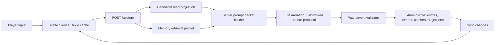

# Deep Research Implementation Plan

Source: `deep-research-report.md`

This plan implements the report's architectural direction while leaving out the numeric target tables. The focus is on code ownership, data flow, canon authority, memory quality, and safe migration.

## Target Shape

Move the app toward a single-writer, many-projection architecture:



Core ownership rule:

- Backend owns authoritative online turns and all durable canon mutations.
- Dexie owns offline cache, recent transcript mirror, optimistic UI, and queued offline commands.
- Transcript is evidence, not canon.
- Canon is entities, factions, memberships, resources, relationships, beliefs, agreements, threads, events, patches, and memory nodes.
- Memory packets are compact, source-linked, and scoped to narrator truth plus relevant actor beliefs.

## Non-Goals

- Do not implement metric dashboards from the report in this pass.
- Do not replace Postgres with another database or search stack yet.
- Do not introduce Temporal, Trigger.dev, Inngest, or BullMQ before the Postgres outbox path is exhausted.
- Do not remove offline play; narrow it into queued commands and cache behavior.

## Phase 1: Turn Ownership Boundary

Goal: make `/api/turn` the intended online command path without breaking existing browser play.

Files to touch first:

- `src/routes/api/turn/+server.ts`
- `src/lib/server/memory/turn.ts`
- `src/lib/contracts/memory.ts`
- `src/lib/components/story/ActionInput.svelte`
- `src/lib/services/backendMemory.ts`

Tasks:

1. Add an app setting or story-level feature flag for server-authoritative turns.
2. Expand `turnRequestSchema` with enough context for the server path:
   - `storyId`
   - `clientTurnId`
   - `playerText`
   - `localVersion`
   - optional provider/model request hints
   - optional client-side hot context while the server projection is incomplete
3. Expand `turnResponseSchema` to return:
   - `narration`
   - `assistantEntryId`
   - `playerEntryId`
   - `statePatchIds`
   - `eventIds`
   - `memoryNodeIds`
   - `retrievedMemoryIds`
   - `serverVersion`
   - `syncChanges`
   - `warnings`
4. Keep the current browser path as compatibility mode.
5. In server-turn mode, `ActionInput.svelte` should call `/api/turn` instead of streaming locally.
6. After the response, apply returned `syncChanges` to Dexie instead of running local canon mutation tools.

Important rule: online server-turn mode must not call browser-side `executeWorldUpdate` after narration. The state update has to come back from the backend.

## Phase 2: Server Turn Orchestrator

Goal: replace the current backend envelope with a real turn pipeline.

Create server-side modules:

- `src/lib/server/turn/orchestrator.ts`
- `src/lib/server/turn/context.ts`
- `src/lib/server/turn/promptPacket.ts`
- `src/lib/server/turn/patchValidator.ts`
- `src/lib/server/turn/repository.ts`

Pipeline:

1. Parse and validate the turn command.
2. Idempotently create or reuse the player `story_entries` row for `clientTurnId`.
3. Load canonical story state from Postgres:
   - story metadata
   - current location
   - relevant entities
   - present or referenced NPCs
   - factions
   - memberships
   - resources
   - agreements
   - active threads
   - recent events
   - NPC beliefs for present or referenced actors only
4. Retrieve memory with `retrieveMemoryPacket`.
5. Build a server prompt packet:
   - stable narrator rules
   - current scene canon
   - faction pressure
   - actor belief scopes
   - source-linked memory packet
   - recent dialogue
6. Call the configured LLM provider.
7. Extract structured state proposals from the response.
8. Validate proposals into accepted events and patches.
9. Write player entry, narration entry, events, patches, memory nodes, and version bump in one transaction.
10. Return narration plus sync changes.

Initial implementation can be non-streaming. Add streaming once the transactional write path is stable.

## Phase 3: Patch And Event Authority

Goal: make events and validated patches the only durable mutation ledger.

Files and areas:

- `src/lib/contracts/memory.ts`
- `src/lib/server/db/schema.ts`
- `src/lib/server/memory/canonical.ts`
- new `src/lib/server/turn/patchValidator.ts`

Tasks:

1. Define allowed patch paths for canon objects instead of accepting arbitrary JSON patch paths.
2. Add validators for:
   - entity existence
   - faction existence
   - membership existence
   - location references
   - thread references
   - agreement references
   - NPC belief references
3. Convert accepted patches into source-linked `story_events`.
4. Reject or mark `needs_repair` for destructive or ambiguous patches.
5. Store every derived object with source refs:
   - `sourceEntryIds`
   - `sourceEventIds`
   - `sourcePatchIds`
6. Make `applySyncOperation` use the same validator path as `/api/turn`.

Do not allow silent prose edits to become canon.

## Phase 4: Canon Normalization

Goal: stop faction and relationship drift by making core political state first-class.

Current backend has `factions.memberEntityIds` and `factions.resources` as JSON. That is better than the local polymorphic lorebook, but the report's direction calls for stronger canon.

Add migrations for:

- `faction_memberships`
  - `id`
  - `storyId`
  - `factionId`
  - `entityId`
  - `role`
  - `rank`
  - `status`
  - `visibility`
  - source refs
  - sync metadata
- `faction_resources`
  - `id`
  - `storyId`
  - `factionId`
  - `kind`
  - `name`
  - `amount`
  - `status`
  - `locationId`
  - source refs
  - sync metadata
- `faction_goals`
  - `id`
  - `storyId`
  - `factionId`
  - `goal`
  - `status`
  - `priority`
  - `secrecy`
  - source refs
  - sync metadata

Then update:

- import mapping from local `lorebookEntries` faction state
- backend bootstrap response
- sync pull/push row handling
- memory retrieval filters
- prompt packet faction section
- Memory tab faction panels

Keep the existing `factions.goals`, `factions.resources`, and `factions.memberEntityIds` as compatibility projections until the UI no longer writes to them.

## Phase 5: Dexie Demotion

Goal: make Dexie a cache and offline queue instead of a competing source of truth.

Files:

- `src/lib/services/database.ts`
- `src/lib/services/backendMemory.ts`
- `src/lib/services/storySync.ts`
- `src/lib/components/story/ActionInput.svelte`
- `src/lib/stores/story.svelte.ts`

Tasks:

1. Add local cache tables or metadata for backend-owned rows if existing tables cannot safely mirror them.
2. Treat online `syncChanges` as the source for local row updates.
3. Change offline turns into queued `turn_command` or existing `create_entry` style ops.
4. When reconnecting:
   - push queued commands
   - pull backend changes
   - replay unresolved local commands as new ops
   - surface destructive conflicts as repair items
5. Remove online local writes that claim to be canonical after server-turn mode is enabled.
6. Keep local transcript and optimistic display for responsiveness.

Compatibility mode can keep the old path for unlinked local-only stories.

## Phase 6: Memory Packet V2

Goal: make long-roleplay recall source-linked, compact, and actor-aware.

Files:

- `src/lib/server/memory/retrieval.ts`
- `src/lib/server/memory/ranking.ts`
- `src/lib/server/memory/canonical.ts`
- `src/lib/services/ai/background/runner.ts`
- `src/lib/stores/story.svelte.ts`

Tasks:

1. Make current action drive retrieval every turn.
2. Candidate generation should combine:
   - exact entity and alias matches
   - Postgres full-text search
   - pgvector similarity when embeddings exist
   - metadata filters for location, entities, factions, threads, visibility, and source type
3. Rerank into a compact packet with:
   - source refs
   - short fact text
   - why it was selected
   - visibility and actor-belief scope
4. Generate memory nodes from story events and applied patches, not just broad summaries.
5. Rebuild chapter and arc summaries around structured fields:
   - scene outcome
   - irreversible changes
   - NPC knowledge changes
   - promises, debts, and oaths
   - discovered clues
   - relationship changes
   - faction changes
   - open threads
   - source ids
6. Keep local retrieval only as offline fallback.

Prompt rule: narrator receives world truth; NPCs receive only what their beliefs and sensory access justify.

## Phase 7: Background Work And Outbox

Goal: make world sim, memory indexing, summaries, and projection updates retryable.

Start with Postgres, not a new workflow platform.

Add or extend:

- backend outbox table, or formalize `sync_ops` plus a server-only job table
- worker script under `scripts/` or `src/lib/server/jobs`
- retry metadata
- job type enum

Jobs:

- create memory nodes from events
- embed memory nodes
- summarize chapters
- roll up arcs
- evaluate world sim ticks
- update faction pressure
- rebuild retrieval projections after import

Only evaluate BullMQ, Trigger.dev, Inngest, or Temporal after this job graph becomes hard to operate.

## Phase 8: UI And Migration

Goal: expose the new canon model without overwhelming play.

UI work:

- Memory tab: what matters now, open threads, obligations, faction pressure, NPC beliefs, retrieved-memory debug.
- Faction panels: members, resources, goals, recent moves, allies, enemies, pressure.
- Repair items: rejected patches, destructive sync conflicts, ambiguous merges.
- Story settings: server-linked status, offline queue status, compatibility mode warning.

Migration work:

1. Import existing IndexedDB bundles.
2. Map local lorebook entries into backend entities.
3. Map faction entry state into factions, memberships, resources, goals, and relationships.
4. Map chapters, arcs, threads, agreements, world events, schemes, rumors, and conversation memory into source-linked backend rows where possible.
5. Report skipped and merged rows.
6. Bind the local story to `serverStoryId`.
7. Pull bootstrap data back into Dexie cache.

## Test Plan

Unit tests:

- patch validator rejects invalid entity, faction, location, thread, and agreement references
- patch validator marks destructive ambiguity as `needs_repair`
- NPC belief retrieval does not leak secret canon to uninformed actors
- faction membership/resource mapping preserves source refs
- memory ranking respects entity, faction, location, thread, and visibility filters

Integration tests:

- `/api/turn` creates player entry, narration entry, events, patches, memory nodes, version bump, and sync changes
- idempotent retry with the same `clientTurnId` does not duplicate entries
- sync push uses the same patch validator as server turns
- import maps local faction state into normalized backend tables
- bootstrap and pull return enough rows for Dexie cache hydration

Scenario tests:

- player references an old promise and retrieval surfaces the source-linked event
- NPC reacts only to facts they know or could observe
- faction members, resources, goals, and recent moves stay together through import, turn update, retrieval, and UI
- a closed thread does not keep showing as immediate pressure
- chapter and arc rebuilds preserve source event links

Verification commands:

```bash
npm run check
npm test
npm run build
```

## Recommended First Patch

The safest first implementation slice is not a schema migration. It is the server turn boundary:

1. Add expanded turn contracts.
2. Add `src/lib/server/turn/orchestrator.ts` with the full pipeline shape.
3. Move the current `processBackendTurn` logic behind the orchestrator as `compatibilityEnvelope`.
4. Add idempotent player-entry and assistant-entry write helpers.
5. Add a feature flag in the client that can call `/api/turn` and apply returned sync changes.
6. Leave local narration as compatibility mode until the server orchestrator can generate narration and validated patches.

After that lands, normalize factions and memory with less risk because there will be one online write path to enforce the new rules.
